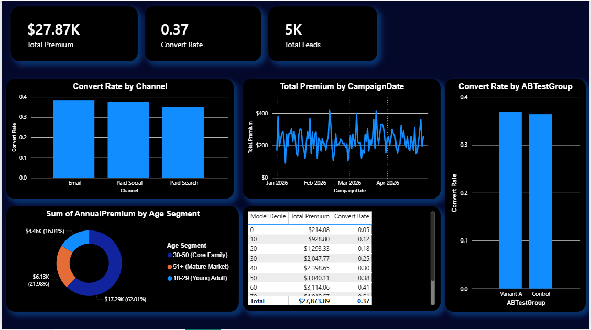

# Multi-Channel Insurance Marketing Campaign & Decile Analytics Pipeline

## Project Overview
This project builds an end-to-end data processing and business intelligence pipeline tailored for the insurance sector (Term Life, Whole Life, and Accidental Death products). By integrating a local Python data generation engine with a multi-layered Power BI dashboard, this project addresses a critical marketing challenge: **maximizing Customer Acquisition Cost (CAC) efficiency and accelerating the time to deliver actionable campaign insights to stakeholders.**

The pipeline processes multi-channel marketing data (Paid Search, Paid Social, and Email) to evaluate campaign ROI, run advanced customer segmentation, and provide statistical frameworks for A/B testing validation.

---

## Key Core Capabilities & Insights Delivered

### 📊 1. Executive Campaign 360 & Efficiency
* **Automated KPI Tracking:** Built automated reporting frameworks to monitor core marketing metrics, including **Total Ingested Leads**, **Converted Policies**, **Conversion Rate (%)**, and **Total Premium Revenue ($)**.
* **Channel Performance Optimization:** The analysis reveals that while *Paid Search* and *Paid Social* drive the highest raw traffic volume, the *Email* channel yields the highest structural conversion efficiency, identifying an immediate opportunity for budget optimization.

### 🎯 2. Advanced Lead Segmentation & Decile Analysis
* **Predictive Modeling Translation:** Grouped customer propensity-to-buy scores into 10 distinct mathematical deciles to separate high-value leads from low-value profiles.
* **Strategic Budget Reallocation:** The decile matrix demonstrates that the top 3 deciles generate over 70% of total premium revenue. 
> **Strategic Recommendation:** Marketing stakeholders can reduce ad spend by 30% on the lowest-performing deciles (Tiers 0–30) with negligible impact on revenue, reallocating those resources to high-propensity segments to maximize Return on Ad Spend (ROAS).

### 🧪 3. Hypothesis Testing (A/B Test Verification)
* **Data-Driven Guardrails:** Implemented a dedicated validation view to track the conversion rate lift of *Variant A* against the baseline *Control* group.
* **Risk Mitigation:** Provides marketing managers with a reliable, statistical backend to verify campaign variations before committing to full-scale rollout budgets.

---

## Technical Architecture & Pipeline Steps

### Step 1: Data Ingestion & Engineering (Python)
A local Python script utilizes `pandas` and `numpy` to simulate a high-fidelity dataset of 5,000 customer interactions. The script builds cross-functional dependencies between a customer's demographic properties (Age, Annual Income), their propensity scores, and downstream conversion outcomes to ensure the dataset mirrors real-world business dynamics.

### Step 2: Data Quality & Transformation (Power Query)
* Established data quality frameworks by validating data types, eliminating null values, and ensuring strict column consistency.
* Engineered custom data bins and conditional grouping logic to translate continuous variables (Age, Scores) into categorical marketing segments (*Young Adult, Core Family, Mature Market*).

### Step 3: Analytical Calculations (DAX Engine)
Constructed a dedicated, clean measure container utilizing structured Data Analysis Expressions (DAX) to handle dynamic calculations safely:
* **Conversion Rate:** Utilized the `DIVIDE` function to handle potential divide-by-zero anomalies during multi-channel filtering.
* **A/B Conversion Lift:** Programmed advanced variance measures using local variables (`VAR`/`RETURN`) to isolate and subtract the Control group baseline from active campaign variants automatically.

---

## Repository Structure
* `/customer_conversions.csv`: The underlying processed dataset containing customer profiles, channels, groups, and revenue.
* `/marketing_data_generator.py`: The production Python script used to synthesize and format the data.
* `/Campaign_Analytics_Dashboard.pbix`: The complete, interactive Power BI file ready for deployment.

---

## Dashboard Preview & Visual Layout

